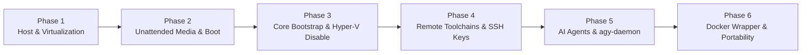

# Windows Core Headless Development Host — Project Roadmap

This roadmap outlines the phased development, automation, unattended provisioning, and lifecycle management of a lightweight **Windows Server Core (Hyper-V Server 2019 RS5)** virtualized guest running headlessly on Ubuntu Linux.

---

## 🧭 Milestone Overview



| Phase | Milestone | Focus Area | Primary Deliverables | Status |
| :--- | :--- | :--- | :--- | :--- |
| **Phase 1** | Host Setup & Virtualization Tooling | Ubuntu Host Readiness | `setup-host.sh` / `.ps1`, VirtIO ISO downloader | `[ ] Planned` |
| **Phase 2** | Unattended Media & QEMU Boot | Dual-Drive Boot Pipeline | `build-iso.sh` / `.ps1`, `run-vm.sh` / `.ps1`, QCOW2 sparse disk | `[ ] Planned` |
| **Phase 3** | Core Bootstrap & Hyper-V Deactivation | FirstBoot & Guest Specialization | `Specialize.ps1`, OpenSSH, pwsh 7, Hyper-V removal | `[ ] Planned` |
| **Phase 4** | Remote Toolchains & SSH Keys | Post-Boot Remote Orchestration | `provision-remote.sh` / `.ps1`, `Install-Tools.ps1` (Git, Node, Python) | `[ ] Planned` |
| **Phase 5** | AI Agent Stack & Antigravity Remote Control | Agent Execution Node | `Setup-Agents.ps1`, `agy-daemon` Service, CLI tests | `[ ] Planned` |
| **Phase 6** | Docker Wrapper & Portability | Containerization & Proxmox | `docker-compose.yml`, VNC fallback, backup scripts | `[ ] Planned` |

---

## 📌 Phase 1: Host Environment & Virtualization Tooling

**Objective**: Ensure the headless Ubuntu Desktop host is fully configured with KVM kernel modules, QEMU virtualization binaries, UEFI/OVMF firmware, ISO manipulation utilities, and PowerShell 7.

### Deliverables & Tasks
- [ ] **Host Dependency Script** ([`scripts/host/setup-host.sh`](file:///home/samuelcaldas/repos/windows-core/scripts/host/setup-host.sh) / [`scripts/host/setup-host.ps1`](file:///home/samuelcaldas/repos/windows-core/scripts/host/setup-host.ps1)):
  - [ ] Check KVM hardware virtualization support (`kvm-ok` / `/dev/kvm`).
  - [ ] Install QEMU packages (`qemu-system-x86`, `qemu-utils`, `ovmf`, `bridge-utils`).
  - [ ] Install ISO & disk tooling (`cloud-image-utils`, `genisoimage` / `xorriso`, `wimtools`, `mtools`).
  - [ ] Verify or install PowerShell Core (`pwsh`) on Ubuntu host.
- [ ] **VirtIO Drivers Fetcher**:
  - [ ] Automate download and hash verification of the latest stable Red Hat VirtIO Windows drivers (`virtio-win.iso`).
  - [ ] Cache downloaded ISO under `iso/virtio-win.iso` (gitignored).

### Acceptance Criteria & Verification
```bash
# Verify KVM acceleration
kvm-ok

# Verify QEMU installation
qemu-system-x86_64 --version

# Verify VirtIO ISO presence
test -f iso/virtio-win.iso && echo "VirtIO ISO present"
```

---

## 📌 Phase 2: Unattended Installation Media & QEMU Boot Pipeline

**Objective**: Create the secondary virtual drive (OEMDRV) containing [`autounattend.xml`](file:///home/samuelcaldas/repos/windows-core/autounattend.xml) and VirtIO drivers, provision a dynamic sparse QCOW2 virtual disk, and launch QEMU in dual-drive mode for zero-touch OS installation.

### Deliverables & Tasks
- [ ] **Secondary Drive Generator** ([`scripts/host/build-iso.sh`](file:///home/samuelcaldas/repos/windows-core/scripts/host/build-iso.sh) / [`scripts/host/build-iso.ps1`](file:///home/samuelcaldas/repos/windows-core/scripts/host/build-iso.ps1)):
  - [ ] Extract required VirtIO storage (`viostor`), network (`NetKVM`), and serial (`vioserial`) drivers from `virtio-win.iso`.
  - [ ] Package [`autounattend.xml`](file:///home/samuelcaldas/repos/windows-core/autounattend.xml), extracted drivers, and guest scripts into a secondary FAT/ISO image labeled `OEMDRV` (`iso/oemdrv.iso`).
- [ ] **Virtual Disk Creation**:
  - [ ] Script sparse QCOW2 disk allocation (`qemu-img create -f qcow2 windows-core.qcow2 64G`).
- [ ] **QEMU VM Orchestrator** ([`scripts/host/run-vm.sh`](file:///home/samuelcaldas/repos/windows-core/scripts/host/run-vm.sh) / [`scripts/host/run-vm.ps1`](file:///home/samuelcaldas/repos/windows-core/scripts/host/run-vm.ps1)):
  - [ ] Configure QEMU execution parameters:
    - KVM acceleration (`-enable-kvm -cpu host,hv_relaxed,hv_spinlocks=0x1fff,hv_vapic,hv_time`).
    - Multi-core CPU (`-smp 4`) and RAM (`-m 4G` or dynamic ballooning).
    - VirtIO SCSI/Block storage controller with TRIM (`discard=unmap`).
    - VirtIO Network device with user-mode port forwarding:
      - SSH: Host `2222` ➔ Guest `22`
      - WinRM: Host `5985` ➔ Guest `5985` / Host `5986` ➔ Guest `5986`
      - Antigravity Daemon: Host `9090` ➔ Guest `9090`
    - Dual CD-ROM attachment (Drive 1: Windows Hyper-V Server base ISO; Drive 2: `oemdrv.iso`).
    - Headless operation with QEMU monitor socket and optional VNC debug port (`-display none -vnc :1` or `-nographic`).

### Acceptance Criteria & Verification
```bash
# Build secondary OEMDRV image
./scripts/host/build-iso.sh

# Launch unattended VM boot
./scripts/host/run-vm.sh --install

# Verification: VM completes partitioning, driver loading, and installation without manual input
```

---

## 📌 Phase 3: Minimal Core Specialization & Guest Bootstrap (Stage 1)

**Objective**: Execute automated FirstBoot specialization inside Windows Server Core via [`autounattend.xml`](file:///home/samuelcaldas/repos/windows-core/autounattend.xml) and guest scripts to strip Hyper-V roles, install VirtIO guest agents, enable OpenSSH Server, and configure PowerShell 7 as the default shell.

### Deliverables & Tasks
- [ ] **Guest Specialization Script** ([`scripts/guest/Specialize.ps1`](file:///home/samuelcaldas/repos/windows-core/scripts/guest/Specialize.ps1)):
  - [ ] Install VirtIO Guest Tools (VirtIO Serial Driver, QEMU Guest Agent `qemu-ga`, Ballooning Service).
  - [ ] Install PowerShell 7 (`pwsh.exe`) via MSI / standalone archive.
  - [ ] Install and configure Windows OpenSSH Server (`OpenSSH.Server~~~~0.0.1.0` or latest GitHub release):
    - Set `sshd` and `ssh-agent` services to `Automatic` startup.
    - Configure default shell to PowerShell 7 (`DefaultShell = "C:\Program Files\PowerShell\7\pwsh.exe"`).
    - Enable Password Authentication for initial bootstrapping.
  - [ ] **Hyper-V Role Deactivation**:
    - Execute `Disable-WindowsOptionalFeature -Online -FeatureName Microsoft-Hyper-V-All -NoRestart`.
    - Set hypervisor launch type in BCD: `bcdedit /set hypervisorlaunchtype off`.
    - Stop and disable Hyper-V management services (`vmms`, `vmic*`).
  - [ ] **Windows Firewall Rules**:
    - Open Inbound TCP port `22` (OpenSSH).
    - Open Inbound TCP ports `5985` / `5986` (WinRM).
    - Open Inbound TCP port `9090` (Antigravity Remote Control Daemon).
  - [ ] Configure local user accounts (`samuelcaldas` as Administrator, non-expiring password).

### Acceptance Criteria & Verification
```bash
# Test SSH connectivity to guest after initial boot
ssh -p 2222 samuelcaldas@localhost "Get-ComputerInfo | Select-Object WindowsProductName, OsArchitecture"

# Verify Hyper-V is disabled
ssh -p 2222 samuelcaldas@localhost "Get-WindowsOptionalFeature -Online -FeatureName Microsoft-Hyper-V-All | Select-Object State"
# Expected State: Disabled
```

---

## 📌 Phase 4: Remote Management, SSH Key Exchange & Toolchains (Stage 2)

**Objective**: Remotely orchestrate the developer toolchain installation from the Linux host over SSH, configure key-based SSH authentication, and install Git, Node.js, Python, and .NET runtime environments.

### Deliverables & Tasks
- [ ] **Remote Provisioning Orchestrator** ([`scripts/host/provision-remote.sh`](file:///home/samuelcaldas/repos/windows-core/scripts/host/provision-remote.sh) / [`scripts/host/provision-remote.ps1`](file:///home/samuelcaldas/repos/windows-core/scripts/host/provision-remote.ps1)):
  - [ ] Authenticate with configured password and push host public SSH key (`~/.ssh/id_ed25519.pub` or `~/.ssh/id_rsa.pub`) to guest.
  - [ ] Deploy key to `C:\ProgramData\ssh\administrators_authorized_keys` and set Windows ACLs (`icacls` granting `NT AUTHORITY\SYSTEM` and `BUILTIN\Administrators` full control, removing inherited permissions).
  - [ ] Verify passwordless SSH connection from Linux host.
- [ ] **Guest Toolchain Installer** ([`scripts/guest/Install-Tools.ps1`](file:///home/samuelcaldas/repos/windows-core/scripts/guest/Install-Tools.ps1)):
  - [ ] Install **Git for Windows**:
    - Enable Long Paths support (`git config --system core.longpaths true`).
    - Set default line endings (`git config --system core.autocrlf input`).
  - [ ] Install **Node.js LTS** (via standalone binary or `fnm` / fast node manager) and configure npm global path.
  - [ ] Install **Python 3.x** with pip, set up `.venv` support, and add Python to System PATH.
  - [ ] Install **.NET Core SDK / Runtime** (latest LTS).
  - [ ] Install CLI utilities: 7-Zip, jq, curl.

### Acceptance Criteria & Verification
```bash
# Execute remote toolchain deployment
./scripts/host/provision-remote.sh

# Verify all developer runtimes via passwordless SSH
ssh -p 2222 samuelcaldas@localhost "pwsh -Command 'git --version; node -v; npm -v; python --version; dotnet --version'"
```

---

## 📌 Phase 5: AI Agent Stack & Antigravity Remote Control

**Objective**: Install and configure Google Antigravity CLI, Claude CLI, Codex CLI, and register the Antigravity Headless Remote Control Daemon (`agy-daemon`) as a 24/7 background Windows service.

### Deliverables & Tasks
- [ ] **Agent Deployment Script** ([`scripts/guest/Setup-Agents.ps1`](file:///home/samuelcaldas/repos/windows-core/scripts/guest/Setup-Agents.ps1)):
  - [ ] Install **Google Antigravity CLI** (`npm install -g antigravity-cli` or binary installer).
  - [ ] Install **Anthropic Claude CLI** (`npm install -g @anthropic-ai/claude-code` or `claude-cli`).
  - [ ] Install **OpenAI Codex CLI** (`npm install -g @openai/codex` / `codex-cli`).
  - [ ] Download Antigravity Remote Control Daemon (`agy-daemon.cmd` from `https://antigravity.google/cli/agy-daemon.cmd`).
  - [ ] **Register `agy-daemon` as a Persistent Service**:
    - Configure `agy-daemon` as a background Windows Service (or Scheduled Task configured to start at System Boot without logon) under the `samuelcaldas` account.
    - Set auto-restart on failure.
    - Configure listening port (`9090`).
- [ ] **Host Verification & Agent Test Script** ([`scripts/host/test-agents.sh`](file:///home/samuelcaldas/repos/windows-core/scripts/host/test-agents.sh) / [`scripts/host/test-agents.ps1`](file:///home/samuelcaldas/repos/windows-core/scripts/host/test-agents.ps1)):
  - [ ] Verify health check on `http://localhost:9090` / Antigravity daemon endpoint.
  - [ ] Run test execution of CLI agent commands via SSH remoting.

### Acceptance Criteria & Verification
```bash
# Test agy-daemon HTTP endpoint
curl -s http://localhost:9090/health || echo "Daemon listening"

# Run remote AI CLI verification
ssh -p 2222 samuelcaldas@localhost "antigravity --version; claude --version; codex --version"
```

---

## 📌 Phase 6: Containerization (Docker Compose Wrapper) & Portability

**Objective**: Provide a secondary deployment model using Docker Compose with KVM device passthrough, integrated web-based VNC fallback for debugging, and automated snapshot management.

### Deliverables & Tasks
- [ ] **Docker Compose Wrapper** (`docker-compose.yml`):
  - [ ] Container definition utilizing KVM passthrough (`/dev/kvm`).
  - [ ] Persistent volume mapping for the finalized `windows-core.qcow2` virtual disk.
  - [ ] Expose forwarded service ports:
    - Port `2222:22` (SSH)
    - Port `5985:5985` (WinRM)
    - Port `9090:9090` (Antigravity Remote Control Daemon)
    - Port `8006:8006` (Web VNC Emergency Debugging Console)
  - [ ] Healthcheck configuration for SSH and daemon availability.
- [ ] **Snapshot & Lifecycle Automation** ([`scripts/host/snapshot.sh`](file:///home/samuelcaldas/repos/windows-core/scripts/host/snapshot.sh) / [`scripts/host/snapshot.ps1`](file:///home/samuelcaldas/repos/windows-core/scripts/host/snapshot.ps1)):
  - [ ] Create instant QCOW2 snapshots before running experimental code or AI agent workflows.
  - [ ] Rollback and snapshot list management commands.
- [ ] **Proxmox VE Portability Reference**:
  - [ ] Document `qm importdisk` commands to directly import the finalized `windows-core.qcow2` into a Proxmox VE cluster.

### Acceptance Criteria & Verification
```bash
# Start containerized Windows Core VM
docker compose up -d

# Verify container health and port access
docker compose ps
curl -I http://localhost:8006  # Web VNC console
ssh -p 2222 samuelcaldas@localhost "hostname"
```

---

## 📂 Repository File Mapping

```
windows-core/
├── iso/                                # Base ISOs & generated OEMDRV (gitignored)
│   ├── 17763...SERVERHYPERCORE.iso     # Base Hyper-V Server 2019 ISO
│   ├── virtio-win.iso                  # Fedora VirtIO Windows drivers
│   └── oemdrv.iso                      # Generated secondary unattended image
├── autounattend.xml                    # Unattended answer file (Schneegans spec)
├── docker-compose.yml                  # Secondary Docker Compose KVM wrapper
├── scripts/
│   ├── host/                           # Dual Bash & PowerShell 7 host management
│   │   ├── setup-host.sh / .ps1        # Phase 1: Host dependencies & VirtIO fetcher
│   │   ├── build-iso.sh / .ps1         # Phase 2: Generates OEMDRV virtual ISO
│   │   ├── run-vm.sh / .ps1            # Phase 2: QEMU runner with port forwarding
│   │   ├── provision-remote.sh / .ps1  # Phase 4: SSH key exchange & remote bootstrap
│   │   ├── test-agents.sh / .ps1       # Phase 5: AI agent verification
│   │   └── snapshot.sh / .ps1          # Phase 6: QCOW2 snapshot & rollback manager
│   └── guest/                          # Guest-side post-install PowerShell scripts
│       ├── Specialize.ps1              # Phase 3: Core bootstrap & Hyper-V disable
│       ├── Install-Tools.ps1           # Phase 4: Git, Node.js, Python, .NET
│       └── Setup-Agents.ps1            # Phase 5: Antigravity, Claude, Codex, agy-daemon
├── docs/                               # Documentation & architecture guides
├── ROADMAP.md                          # Phased project roadmap (this file)
├── GEMINI.md                           # Project context and specifications
└── CLAUDE.md                           # Operational rules & coding standards
```
