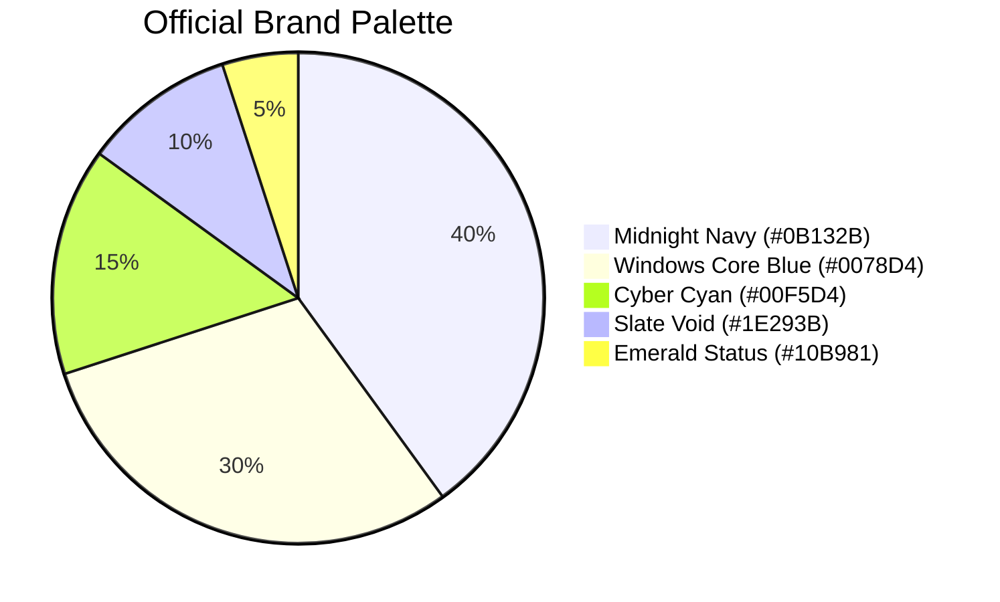

# Windows CoreOS (WCOS) — Visual Identity & Brand Manual


---

## 1. Brand Essence & Mission

### 1.1 Purpose
**Windows CoreOS (WCOS)** is a free, modern, headless-first Windows Server Core distribution and automation framework. It transforms vanilla **Microsoft Hyper-V Server 2019 / Windows Server Core 2019** into an ultra-lean, high-performance workstation and deployment node for developers, DevOps engineers, and autonomous AI agents.

### 1.2 Core Pillars
1. **Headless & Ultra-Light**: Runs comfortably in ~500MB of RAM, eliminating graphical desktop bloat while preserving 100% native Win32, .NET, and Windows kernel compatibility.
2. **AI-Agent & Automation First**: Native runtime support for **Google Antigravity CLI** (`antigravity-cli`, `agy-daemon`), **Anthropic Claude Code**, **OpenAI Codex CLI**, and automated OpenSSH orchestration.
3. **Zero-Downtime Hot-Swaps**: Powered by **OmniGet (`og`)**, featuring file-level in-use binary rotation so that active shells and remote OpenSSH connections never terminate during software updates.
4. **Zero Bloat, Zero Telemetry**: Stripped of consumer services, bundled with Dan Pollock's zero-route DNS hosts blocklist (13,000+ domains), and tuned for pure developer productivity.
5. **Legally Transparent & Clean**: An open-source automation layer that respects Microsoft's copyright by requiring users to supply their own official Microsoft evaluation or licensed ISOs.

---

## 2. Brand Architecture & Naming Guidelines

### 2.1 Official Naming Conventions

| Usage Type | Canonical Name | Examples |
| :--- | :--- | :--- |
| **Formal / Full Name** | `Windows CoreOS` | "Windows CoreOS is an open-source distribution..." |
| **Short Name / Acronym** | `WCOS` | "Deploying the WCOS developer node..." |
| **Tagline** | `Free Windows Server Core Distribution` | "Windows CoreOS: Free Windows Server Core Distribution" |
| **CLI / Packaging Slug** | `wcos` | `wcos-scripts.zip`, `wcos.iso` |

### 2.2 Distinction from Linux CoreOS
To prevent any brand confusion with Red Hat CoreOS / Fedora CoreOS:
- **Always** prefix with "Windows" or use the "WCOS" acronym in public titles, repository names, and documentation.
- **Never** refer to this project simply as "CoreOS" in isolated enterprise contexts without the Windows prefix or WCOS identifier.

### 2.3 Capitalization Rules
- ✅ `Windows CoreOS`
- ✅ `WCOS`
- ❌ `windows coreos`
- ❌ `Windows Core Os`
- ❌ `wcos` (except in terminal command line arguments, filenames, or environment variables)

---

## 3. Visual Identity System

### 3.1 Color Palette



| Color Name | Hex Code | RGB | Role / Usage |
| :--- | :--- | :--- | :--- |
| **Midnight Navy** | `#0B132B` | `11, 19, 43` | Primary dark background canvas, bootscreen, and terminal surface. |
| **Windows Core Blue** | `#0078D4` | `0, 120, 212` | Primary brand accent, button backgrounds, and official link highlights. |
| **Cyber Cyan** | `#00F5D4` | `0, 245, 212` | Neon glow, terminal cursor highlights, active tabs, and logo accents. |
| **Deep Azure** | `#00D2FF` | `0, 210, 255` | Gradient endpoints and primary border stroke highlights. |
| **Slate Void** | `#1E293B` | `30, 41, 59` | Secondary cards, pill badges, and table headers. |
| **Emerald Status** | `#10B981` | `16, 185, 129` | Online node indicators, success badges, and healthy service states. |
| **Cloud White** | `#F8FAFC` | `248, 250, 252` | Primary typography on dark backgrounds. |
| **Steel Gray** | `#94A3B8` | `148, 163, 184` | Muted subtitles, code descriptions, and borders. |

---

## 4. Typography

### 4.1 Monospace & Command Line
Used for terminal sessions, code blocks, ASCII banners, and version tags:
- **Primary**: `Cascadia Code` (Official Microsoft open-source terminal font)
- **Secondary**: `JetBrains Mono` / `Fira Code`
- **Fallback**: `Consolas`, `Courier New`, `monospace`

### 4.2 User Interface & Documentation Headings
Used for web docs, GitHub README, and graphical window titles:
- **Primary**: `Segoe UI` (Windows native) / `Inter` (Web docs)
- **Fallback**: `-apple-system`, `BlinkMacSystemFont`, `Roboto`, `sans-serif`

---

## 5. Logo Assets & Applications

All vector brand assets are stored in [`docs/branding/assets/`](assets/):

```
docs/branding/assets/
├── wcos-logo-horizontal.svg  # Master horizontal banner logo
├── wcos-logo-square.svg      # Square profile & avatar icon
├── wcos-icon.svg             # Standalone hexagonal server core icon
└── wcos-badge.svg            # Markdown status badge for READMEs
```

### 5.1 Icon Anatomy
The **WCOS Hexagonal Core** features:
1. **Isometric Cube Geometry**: Symbolizes modular server infrastructure and virtualized container environments.
2. **Terminal Grid Vectors**: Cyan perspective lines representing network connectivity and OpenSSH remoting.
3. **Stylized 'W' Glyph**: An electric neon prompt (`>_`) forming the letter `W` for Windows.
4. **Active Node Dot**: Emerald green status indicator denoting 24/7 headless availability.

### 5.2 Clear Space & Minimum Sizes
- **Clear Space**: Maintain a margin of at least 50% of the icon's width around all logos.
- **Minimum Digital Sizes**:
  - Horizontal Logo: `180px` wide
  - Square Avatar: `48px × 48px`
  - Hexagonal Icon: `24px × 24px`

---

## 6. Terminal & Shell Branding

### 6.1 ASCII / ANSI Art MOTD (`motd.txt`)
Displayed on SSH login and terminal launch:

```text
   __      ___           _                     _____              ____   _____ 
   \ \    / (_)         | |                   / ____|            / __ \ / ____|
    \ \  / / _ _ __   __| | _____      _____ | |     ___  _ __ ___| |  | | (___  
     \ \/ / | | '_ \ / _` |/ _ \ \ /\ / / __|| |    / _ \| '__/ _ \ |  | |\___ \ 
      \  /  | | | | | (_| | (_) \ V  V /\__ \| |___| (_) | | |  __/ |__| |____) |
       \/   |_|_| |_|\__,_|\___/ \_/\_/ |___(_)_____\___/|_|  \___|\____/|_____/ 
                                                                                   
 ==================================================================================
  Windows CoreOS (WCOS) — Free Windows Server Core Distribution for Developers & AI
 ==================================================================================
  • Shell: PowerShell 7 (pwsh)              • Remote Access: OpenSSH / WinRM
  • Store: OmniGet (og)                     • Kernel: Windows Server Core RS5 (17763)
  • Docs: https://github.com/samuelcaldas/windows-core-free
 ----------------------------------------------------------------------------------
  Quick Commands:
    og search <pkg>      Search packages across Ninite, GitHub, Direct, Distro
    og install <pkg> -s  Install software silently
    og preset DevStack   Deploy complete development stack
    sconfig              Launch Windows Server Core Configuration Utility
 ==================================================================================
```

---

## 7. Brand Dos and Don'ts

| Practice | Status | Details |
| :--- | :--- | :--- |
| **Describe as an automation layer** | ✅ **DO** | Clearly communicate that WCOS is a set of automation scripts and answer files configuring official Windows media. |
| **Link to official Microsoft ISO** | ✅ **DO** | Provide direct links to Microsoft's Evaluation Center so users fetch genuine software. |
| **Maintain high contrast** | ✅ **DO** | Use Cyber Cyan (`#00F5D4`) and Cloud White on dark backgrounds for accessibility. |
| **Redistribute copyrighted ISOs** | ❌ **NEVER** | Never package or publish proprietary Microsoft Windows installation media or keys. |
| **Alter logo proportions** | ❌ **NEVER** | Do not stretch, skew, or rotate the hexagonal core icon. |
| **Claim Microsoft endorsement** | ❌ **NEVER** | Do not present WCOS as an official Microsoft product or subsidiary distribution. |
