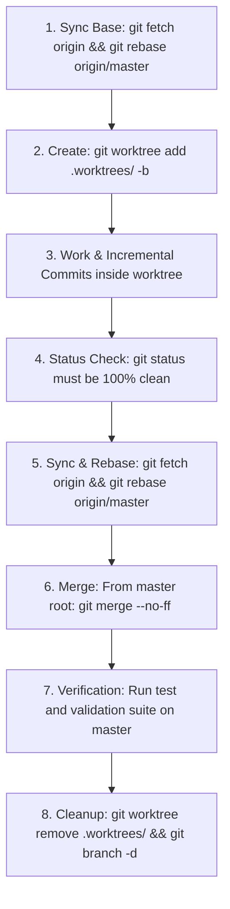

# Autonomous AI Agent Operating Guidelines

This document establishes the mandatory architecture, coding rules, git workflow, and verification standards for autonomous AI agents (Google Antigravity, Claude Code, OpenAI Codex) operating in the **Windows CoreOS (WCOS)** codebase.

---

## 🛑 Fundamental Agent Rules

1. **Strict Prohibition of Root `C:\` Application Folders**: Applications, runtimes, package engines, or temporary scripts MUST NEVER create installation directories directly on `C:\` (e.g., `C:\ReactShell`, `C:\OmniGet`, `C:\Tools` are strictly forbidden). All 64-bit software must reside in `C:\Program Files\<VendorOrToolName>`.
2. **Never Open Pull Requests**: In this repository, AI agents merge worktrees directly into `master` using `--no-ff`. Pull requests are prohibited.
3. **Dirty Worktree Stop Rule**: If `git status` reveals untracked or modified files, commit them immediately before any rebase or branch switch. Never operate on a dirty tree.
4. **Fail Fast**: Validate inputs, environment prerequisites, and credentials at function boundaries before executing side effects or long-running commands.

---

## 🌿 Worktree Lifecycle for Agents

Autonomous subagents must follow this exact 8-step lifecycle:



---

## 🏛️ Coding Standards & Object Calisthenics

When writing PowerShell (`.ps1`), Bash (`.sh`), Python, or C# code:

1. **One Indentation Level Per Function**: Extract nested conditional blocks into dedicated, descriptive helper functions.
2. **No `else` Keyword**: Rely on guard clauses, early returns, or polymorphism.
3. **Keep Entities Small**: Functions ≤ 15 lines, classes ≤ 100 lines, scripts ≤ 200 lines where practical.
4. **Descriptive Names**: No abbreviations (`mgr`, `btn`, `tmp` are forbidden; use `manager`, `button`, `temporary`).
5. **Robust Error Handling**: Wrap only fallible I/O or network calls in `try/catch`. Catch specific exceptions; never swallow errors silently.
6. **Idempotence**: Scripts must be safe to re-run multiple times without duplicating data or corrupting state.

---

## 🔍 Live Verification Protocols

Before declaring any task or feature complete, agents must verify execution against the live Windows CoreOS virtual machine:

### 1. SSH Connectivity Check
```bash
ssh -p 2222 username@127.0.0.1 -T "pwsh -v; whoami"
```

### 2. Package Manager Check
```bash
ssh -p 2222 username@127.0.0.1 -T "og version"
```

### 3. Syntax Verification
```bash
# Validate all bash scripts
find scripts/ -name "*.sh" -exec bash -n {} +

# Validate all PowerShell scripts
pwsh -Command "Get-ChildItem -Recurse scripts/*.ps1 | ForEach-Object { [System.Management.Automation.Language.Parser]::ParseFile(\$_.FullName, [ref]\$null, [ref]\$errs); if (\$errs) { throw \$errs } }"
```
