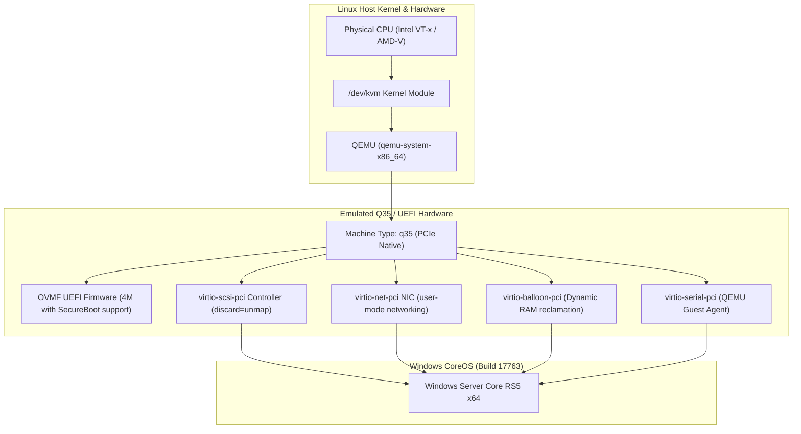

# Architecture & Hardware Configuration

This document outlines the hardware emulation, hypervisor topology, device drivers, and storage architecture powering **Windows CoreOS (WCOS)**.

---

## 🏛️ Virtualization & Hypervisor Layer

Windows CoreOS runs as a hardware-accelerated guest inside the Linux Kernel-based Virtual Machine (**KVM**) managed via direct **QEMU** automation (`qemu-system-x86_64`).



---

## ⚙️ QEMU Machine Configuration

WCOS uses modern PCIe-based emulation (`q35`) paired with Microsoft Hyper-V enlightenments for near bare-metal CPU performance:

| Parameter | Configuration | Technical Rationale |
| :--- | :--- | :--- |
| **Machine Type** | `-machine q35,smm=on,accel=kvm` | PCIe root topology, System Management Mode (SMM) required for secure UEFI. |
| **CPU Emulation** | `-cpu host,hv_relaxed,hv_spinlocks=0x1fff,hv_vapic,hv_time` | Passes host CPU flags directly to guest with Windows Hyper-V enlightened timer and locking optimizations. |
| **UEFI Firmware** | `-drive if=pflash,format=raw,readonly=on,file=...OVMF_CODE_4M.ms.fd` | Modern 64-bit UEFI firmware with Microsoft authenticated variables support. |
| **UEFI NVRAM** | `-drive if=pflash,format=raw,file=...OVMF_VARS.fd` | Isolated, writeable EFI NVRAM state for bootloader persistence. |
| **Display / Video** | `-display none -vga std` | Headless execution without requiring an X11 or Wayland display server. |
| **Management** | `-qmp unix:...monitor.sock,server,nowait` | Unix domain socket for programmatic ACPI shutdown and VM introspection. |

---

## 🏎️ VirtIO Device Stack

To avoid legacy IDE/e1000 emulation overhead, WCOS utilizes native Linux **VirtIO** paravirtualized devices:

### 1. Storage: VirtIO SCSI (`virtio-scsi-pci`)
* **Controller**: `virtio-scsi-pci,id=scsi0`
* **Drive Interface**: `scsi-hd,drive=hd0,bus=scsi0.0,bootindex=1`
* **TRIM / Discard Support**: `discard=unmap,detect-zeroes=unmap`
* **Advantage**: Allows Windows to run `Optimize-Volume -DriveLetter C -Defrag -Verbose` to punch holes in the virtual disk, returning freed space back to the Linux filesystem immediately.

### 2. Networking: VirtIO Net (`virtio-net-pci`)
* **Device**: `virtio-net-pci,netdev=net0,mac=52:54:00:12:34:56`
* **Backend**: User-mode networking (`slirp`) with integrated port forwarding.
* **Advantage**: Zero kernel bridging configuration required on the host while delivering full gigabit paravirtualized throughput.

### 3. Memory Ballooning: VirtIO Balloon (`virtio-balloon-pci`)
* **Device**: `virtio-balloon-pci,id=balloon0`
* **Advantage**: Dynamically claims unused RAM from the guest and yields it back to the host operating system without VM reboot.

### 4. Guest Agent: VirtIO Serial (`virtio-serial-pci`)
* **Device**: `virtio-serial-pci` + `qemu-ga`
* **Advantage**: Provides a communication channel between host and guest for clean guest-level quiescing, filesystem freezing, and status reporting.

---

## 💾 Storage Architecture & Sparse Disks

WCOS stores the entire guest installation on a **Sparse QCOW2** virtual disk:

```bash
qemu-img create -f qcow2 windows-core.qcow2 64G
```

### Storage Characteristics
* **Maximum Virtual Capacity**: 64 GB.
* **Initial Physical Size on Host**: ~12 GB (only allocated blocks take space on Linux SSD/NVMe).
* **Sparse Allocation**: Dynamic growth as new developer tools or agent packages are installed.
* **Instant Snapshots**: Safe checkpoints before running experimental agent code:
  ```bash
  # Create snapshot before experimental script
  qemu-img snapshot -c snapshot_clean windows-core.qcow2

  # Rollback instantly if needed
  qemu-img snapshot -a snapshot_clean windows-core.qcow2
  ```

---

## 🌐 Network & Port Forwarding Map

WCOS maps guest services to host loopback ports using QEMU user networking:

| Guest Service | Guest Port | Host Forwarded Port | Purpose | Command Example |
| :--- | :--- | :--- | :--- | :--- |
| **OpenSSH** | `22` | `2222` | Direct CLI access & agent orchestration | `ssh -p 2222 username@127.0.0.1` |
| **WinRM (HTTP)** | `5985` | `5985` | PowerShell Remoting & Ansible | `Enter-PSSession -ComputerName 127.0.0.1 -Port 5985` |
| **WinRM (HTTPS)**| `5986` | `5986` | Secure PowerShell Remoting | `Enter-PSSession -UseSSL -Port 5986` |
| **Antigravity** | `9090` | `9090` | Headless Remote Control Daemon (`agy-daemon`) | `curl http://127.0.0.1:9090/health` |
| **RDP (Optional)** | `3389` | `3389` | Fallback GUI console debugging | `xfreerdp /v:127.0.0.1:3389 /u:samuelcaldas` |
