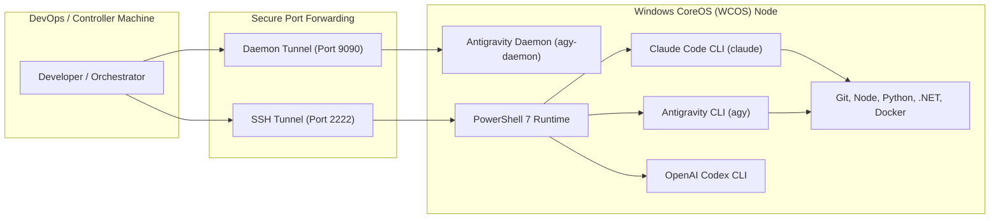

# Autonomous AI Agent Workstation

**Windows CoreOS (WCOS)** is specifically optimized to serve as a high-performance, autonomous **AI Agent Workstation** and remote execution node.

---

## 🤖 Supported AI Agent Ecosystem

WCOS natively supports the leading agentic developer CLI tools and remote control protocols:



### 1. Google Antigravity CLI & Remote Control Daemon
* **Package**: `antigravity-cli`
* **Headless Daemon**: `agy-daemon` listening on port `9090` (or `localhost:9090`).
* **Remote Control Protocol**: Conforms to the [Antigravity Remote Control Specification](https://antigravity.google/docs/remote-control/), allowing external orchestrators, IDEs, and browser workflows to inspect state, trigger tool execution, and stream terminal actions asynchronously.
* **Firewall Rule**: Automatically opened on port `9090` by `Specialize.ps1`.

### 2. Anthropic Claude Code CLI
* **Package**: `@anthropic-ai/claude-code` (`claude`)
* **Runtime**: Node.js LTS 64-bit (`C:\Program Files\nodejs\node.exe`).
* **Configuration**: State persisted in `C:\Users\samuelcaldas\.claude`.
* **Execution**: Fully supported over headless SSH sessions with TrueColor ANSI rendering.

### 3. OpenAI Codex CLI
* **Package**: `codex-cli`
* **Execution**: Automated shell command synthesis and code refactoring pipelines.

---

## ⚙️ Automated Agent Provisioning (`Setup-Agents.ps1`)

WCOS automates the deployment and configuration of the agent stack:

```powershell
# Inside Windows CoreOS or via SSH
& "C:\Provisioning\scripts\Setup-Agents.ps1"
```

The script performs:
1. **PATH Resolution**: Automatically indexes Git, GitHub CLI, Node.js, Python, and npm global binary paths.
2. **Claude Code CLI Installation**: Deploys `@anthropic-ai/claude-code` globally via npm.
3. **Antigravity Daemon Configuration**: Registers `agy-daemon` as a persistent Windows Service or scheduled startup task listening on port `9090`.
4. **Tool Verification**: Validates `git --version`, `gh --version`, `node -v`, `npm -v`, `python --version`, and `claude --version`.

---

## 🛡️ Agent Sandboxing & Instant Rollbacks

Running experimental or autonomous AI agents requires robust failure containment. WCOS provides instant rollbacks via KVM/QCOW2 disk snapshots:

### Taking a Clean Pre-Agent Snapshot
```bash
# On Ubuntu host
qemu-img snapshot -c snapshot_before_agent windows-core.qcow2
```

### Reverting After Unexpected Agent Modifications
```bash
# Power off the VM
./scripts/host/run-vm.sh --stop

# Revert to clean snapshot
qemu-img snapshot -a snapshot_before_agent windows-core.qcow2

# Boot back up
./scripts/host/run-vm.sh
```
The VM is restored to its exact pristine state in less than 2 seconds!
