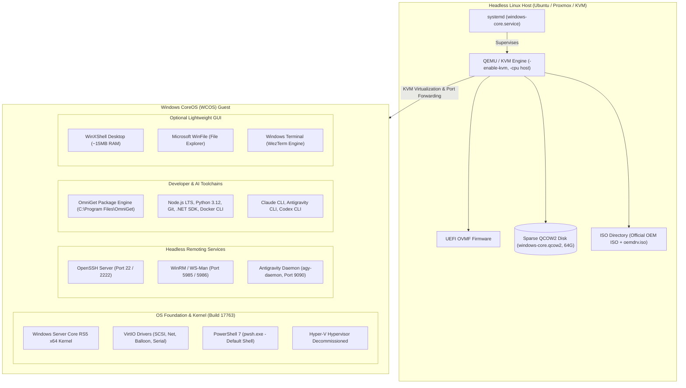

# Welcome to the Windows CoreOS (WCOS) Wiki

**The Free, Ultra-Lightweight Windows Server Core Distribution for Headless Linux (KVM / Ubuntu / Proxmox) and Autonomous AI Agents.**

---

## 🎯 What is Windows CoreOS (WCOS)?

**Windows CoreOS (WCOS)** is an automated build, customization, unattended installation, and lifecycle management layer built on top of **Microsoft Hyper-V Server 2019 OEM x64** (Windows Server Core RS5, build 17763).

Operating as a virtualized guest on Linux KVM/QEMU, Proxmox VE, or Docker, WCOS strips away unnecessary server bloatware, consumer apps, telemetry, and hypervisor components. It delivers a hyper-efficient Windows execution environment that boots in under 15 seconds and consumes only **~530 MB of idle RAM** (down from ~2.1 GB on standard installations).

WCOS is designed from the ground up to act as a **Developer Workstation**, **DevOps CI/CD runner**, and **Autonomous AI Agent Execution Node** running tools such as Google Antigravity CLI (`antigravity-cli`), Anthropic Claude Code CLI (`claude-code`), and OpenAI Codex CLI (`codex-cli`).

---

## ⚡ Key Highlights & Specifications

| Feature | Windows CoreOS (WCOS) | Standard Windows Server 2019 |
| :--- | :--- | :--- |
| **Idle RAM Footprint** | **~530 MB - 600 MB** | 2.1 GB - 2.8 GB |
| **Licensing** | **Free / Legitimate OEM Evaluation** | Paid Commercial License Required |
| **Hyper-V Nested Roles** | **Completely Removed** (no hypervisor conflicts) | Enabled by default |
| **Primary Interaction** | **OpenSSH (PowerShell 7 default shell)** | GUI / Server Manager |
| **Windows Defender** | **Pruned & Disabled** (`MsMpEng` disabled) | Consumes ~250MB RAM constantly |
| **Package Manager** | **OmniGet (`og`)** pre-installed | None / manual downloads |
| **Desktop Environment** | **WinXShell (~15MB RAM)** + WinFile | Full heavy Explorer (~400MB RAM) |
| **AI Agent Support** | Native Google Antigravity & Claude Code | Manual manual setup |
| **Linux Host Supervision** | Systemd native service (`windows-core.service`) | Manual virtualization scripts |
| **DNS Privacy & Adblock** | Dan Pollock zero-route (`0.0.0.0`) 13k+ rules | Unfiltered Windows telemetry |

---

## 🏗️ High-Level System Architecture

---

## 🗺️ Wiki Navigation & Documentation Index

Explore the comprehensive guides below:

### 🚀 Getting Started & Fundamentals
* **[Getting Started](Getting-Started)**: Host prerequisites, one-line setup, downloading the official Microsoft ISO, creating unattended media, and initial VM boot.
* **[Architecture & Hardware](Architecture-and-Hardware)**: Detailed hardware configuration, QEMU flags, VirtIO devices, sparse storage, and port mappings.
* **[Unattended Installation](Unattended-Installation)**: Dual-drive zero-touch provisioning, `autounattend.xml` structure, component bypasses, and bootstrap stages.

### ⚙️ Performance, Tuning & Networking
* **[System Optimization & Memory Pruning](System-Optimization-and-Memory-Pruning)**: How WCOS reclaims RAM, disables Defender and telemetry, decommissions Hyper-V, and installs hosts blocklists.
* **[Remote Access & OpenSSH](Remote-Access-and-SSH)**: Setting up SSH key authentication, PowerShell 7 default shell, ProxyJump jumper hosts, and WinRM.
* **[Host Systemd Autostart](Host-Systemd-Autostart)**: Running WCOS as a native Linux systemd service with auto-boot, failure recovery, and ACPI shutdown.
* **[Proxmox & Docker Portability](Proxmox-and-Docker-Portability)**: Migrating QCOW2 disks to Proxmox VE clusters and containerized execution with Docker.

### 🖥️ Desktop, Software & AI Agents
* **[Desktop Shells & GUI](Desktop-Shells-and-UI)**: Enabling WinXShell, Microsoft WinFile, and WezTerm GPU terminal on Windows Server Core.
* **[Package Management with OmniGet](Package-Management-with-OmniGet)**: Managing developer tools, hot-swapping in-use files, Ninite bundles, and recipes with OmniGet (`og`).
* **[Autonomous AI Agent Workstation](Autonomous-AI-Agent-Workstation)**: Configuring Google Antigravity CLI, Claude Code CLI, and headless daemon orchestration.

### 🛡️ Governance, Standards & Operations
* **[Brand Identity & Assets](Brand-Identity-and-Assets)**: Brand manual summary, color palettes, vector SVG assets, and ASCII MOTD banner.
* **[Agent Operating Guidelines](Agent-Operating-Guidelines)**: Rules for AI agents, worktree lifecycle, coding standards, and filesystem hierarchy policies.
* **[Release & Versioning Guide](Release-and-Versioning-Guide)**: Semantic Versioning (SemVer 2.0.0), Git tags single source of truth, and GitHub Actions CI/CD release pipeline.
* **[Troubleshooting & FAQ](Troubleshooting-and-FAQ)**: Diagnosing OpenSSH, WinRM, KVM permissions, Windows activation, and common questions.

---

## ⚖️ Legal Disclaimer

> [!IMPORTANT]
> **Windows CoreOS is an open-source automation layer distributed under the MIT License.**
> This project DOES NOT mirror, host, or redistribute proprietary Microsoft Windows binaries, ISO media, or product activation keys.
> Users must obtain their own legitimate installation media directly from official Microsoft channels.
> *Microsoft, Windows, Windows Server, Hyper-V, and PowerShell are registered trademarks of Microsoft Corporation.*
