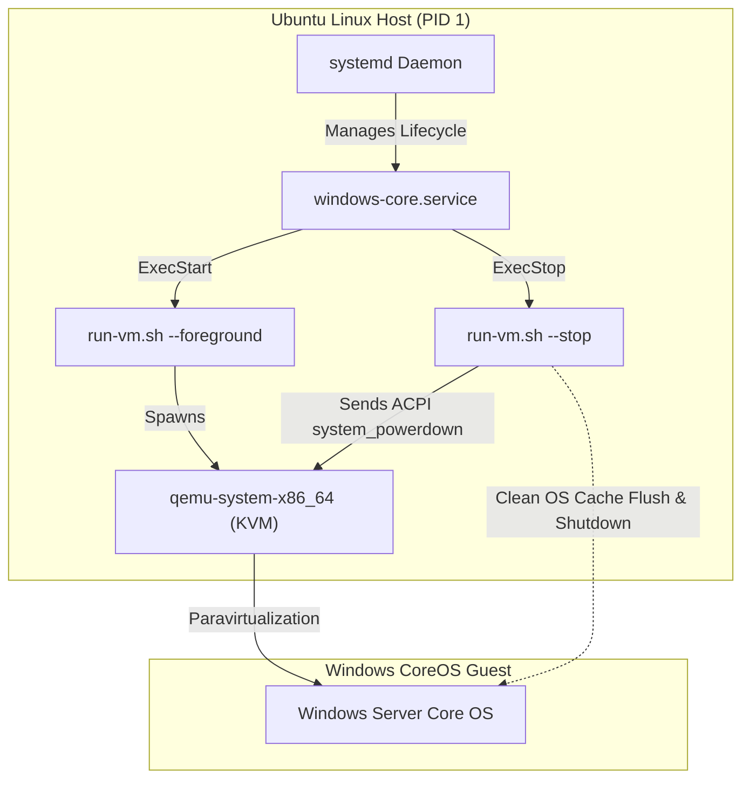

# Host Systemd Autostart & Service Management

This guide documents the native **systemd service** integration for **Windows CoreOS (WCOS)** on Ubuntu and Debian hosts, providing continuous background supervision, automated boot startup, and clean ACPI shutdown orchestration.

---

## 🏛️ Systemd Architecture Overview



---

## ⚡ Quick Service Management

WCOS provides a helper script to generate, validate, and install the systemd service unit:

### 1. Install & Enable Service
```bash
./scripts/host/setup-service.sh --install
```
*Or via PowerShell 7:*
```powershell
./scripts/host/setup-service.ps1 -Install
```

This registers `/etc/systemd/system/windows-core.service`, configures your user as the service runner, reloads systemd, and enables automatic start on host boot.

### 2. Service Commands
| Action | Command |
| :--- | :--- |
| **Start VM** | `sudo systemctl start windows-core.service` |
| **Stop VM (Graceful ACPI)** | `sudo systemctl stop windows-core.service` |
| **Restart VM** | `sudo systemctl restart windows-core.service` |
| **Check Status** | `sudo systemctl status windows-core.service` |
| **View Live Logs** | `journalctl -u windows-core.service -f` |

---

## 📄 Service Unit Definition (`windows-core.service`)

```ini
[Unit]
Description=Windows CoreOS (WCOS) Virtual Machine (QEMU/KVM)
Documentation=https://github.com/samuelcaldas/windows-core-free
After=network.target local-fs.target

[Service]
Type=forking
User=samuelcaldas
Group=samuelcaldas
SupplementaryGroups=kvm libvirt
WorkingDirectory=/home/samuelcaldas/repos/windows-core

# Start VM in background mode
ExecStart=/home/samuelcaldas/repos/windows-core/scripts/host/run-vm.sh --background

# Graceful ACPI Shutdown via QMP monitor socket
ExecStop=/home/samuelcaldas/repos/windows-core/scripts/host/run-vm.sh --stop

# Supervision & Crash Recovery
PIDFile=/home/samuelcaldas/repos/windows-core/.windows-core-qemu.pid
Restart=on-failure
RestartSec=15
TimeoutStopSec=90
KillMode=mixed

# Resource limits for virtualization
LimitNOFILE=65535
LimitMEMLOCK=infinity

[Install]
WantedBy=multi-user.target
```

---

## 🛑 Graceful ACPI Shutdown Mechanism

Unlike abrupt container kills or `SIGKILL`, WCOS implements graceful ACPI shutdown:

1. When `systemctl stop windows-core.service` is triggered, `run-vm.sh --stop` connects to the QEMU QMP monitor socket (`.windows-core-monitor.sock`).
2. Sends the QMP command: `{"execute": "system_powerdown"}`.
3. Windows Core receives the virtual ACPI power button event.
4. Windows notifies running services, stops OpenSSH and Antigravity daemons, flushes NTFS disk caches, and completes clean power-off.
5. If the guest fails to exit within 90 seconds (`TimeoutStopSec=90`), systemd cleanly terminates the process.
