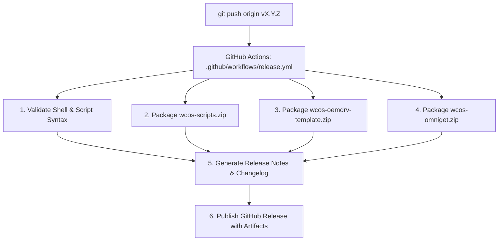

# Release & Versioning Guide

This document establishes the official release management process, Semantic Versioning conventions, and GitHub Actions CI/CD pipeline for **Windows CoreOS (WCOS)**.

---

## 🏷️ Versioning Strategy: SemVer 2.0.0

WCOS adheres strictly to [Semantic Versioning 2.0.0](https://semver.org/):

$$\text{v}\mathbf{X}.\mathbf{Y}.\mathbf{Z}$$

* **MAJOR ($\mathbf{X}$)**: Incompatible architectural breaking changes, major Windows kernel or build shifts, or breaking changes to automation CLI interfaces.
* **MINOR ($\mathbf{Y}$)**: Backward-compatible new features, new software stacks, desktop enhancements, or major performance optimizations.
* **PATCH ($\mathbf{Z}$)**: Backward-compatible bug fixes, security patches, driver updates, or documentation improvements.

---

## 💎 Single Source of Truth: Annotated Git Tags

WCOS uses **Annotated Git Tags** (`v*`) as the sole authoritative source of versioning. There is NO redundant `VERSION` file in the repository.

To query the current version:
```bash
git describe --tags --abbrev=0
```

---

## 🚀 Step-by-Step Version Bumping Procedure

Follow these steps when cutting a new release:

### Step 1: Verify Working Tree Cleanliness
```bash
git status
# Output must be: nothing to commit, working tree clean
```

### Step 2: Validate Shell & PowerShell Script Syntax
```bash
# Validate Bash
find scripts/ -name "*.sh" -exec bash -n {} +

# Validate PowerShell
pwsh -Command "Get-ChildItem -Recurse scripts/*.ps1 | ForEach-Object { [System.Management.Automation.Language.Parser]::ParseFile(\$_.FullName, [ref]\$null, [ref]\$errs); if (\$errs) { throw \$errs } }"
```

### Step 3: Determine Next Semantic Version
Examine recent git log entries:
```bash
git log $(git describe --tags --abbrev=0 2>/dev/null || git rev-list --max-parents=0 HEAD)..HEAD --oneline
```

### Step 4: Create Annotated Git Tag
```bash
# Example: Bumping to v1.1.0
git tag -a v1.1.0 -m "release: Windows CoreOS (WCOS) v1.1.0 - Description of changes"
```

### Step 5: Push Master & Annotated Tag to Remote
```bash
git push origin master
git push origin v1.1.0
```

---

## 🤖 Automated CI/CD Release Pipeline (`.github/workflows/release.yml`)

Pushing any `v*` tag immediately triggers the automated GitHub Actions release workflow:



### Generated Release Artifacts
Every release automatically produces downloadable ZIP bundles:
1. **`wcos-scripts.zip`**: Complete host and guest script automation toolset, answer files, and service definitions.
2. **`wcos-oemdrv-template.zip`**: Ready-to-use template for assembling the secondary virtual drive.
3. **`wcos-omniget.zip`**: Standalone OmniGet package engine for offline provisioning.
